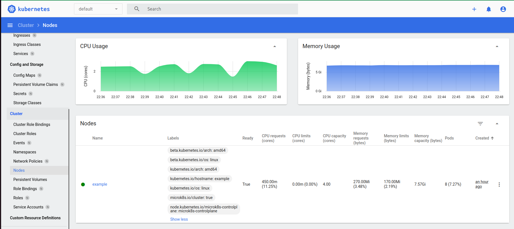

# Домашнее задание к занятию «Kubernetes. Причины появления. Команда kubectl»

## Задание 1. Установка MicroK8S

1. Установить MicroK8S на локальную машину или на удалённую виртуальную машину.

Выполнил команды:
```bash
sudo apt update
sudo apt install snapd
sudo snap install microk8s --classic
sudo usermod -a -G microk8s $USER
sudo chown -f -R $USER ~/.kube
```
Проверил статус:
```bash
sudo microk8s status --wait-ready
```
```
microk8s is running
high-availability: no
...
```
2. Установить dashboard.

Установил аддон:
```bash
microk8s enable dashboard
```
Проверил статус:
```bash
sudo microk8s status
```
```
microk8s is running
high-availability: no
  datastore master nodes: 127.0.0.1:19001
  datastore standby nodes: none
addons:
  enabled:
    dashboard            # (core) The Kubernetes dashboard
...
```
3. Сгенерировать сертификат для подключения к внешнему ip-адресу.

Указал локальный IP-адрес в файле `/var/snap/microk8s/current/certs/csr.conf.template`.

Обновил сертификаты:
```bash
sudo microk8s refresh-certs --cert front-proxy-client.crt
```
```
Taking a backup of the current certificates under /var/snap/microk8s/5643/certs-backup/
Creating new certificates
Signature ok
subject=CN = front-proxy-client
Getting CA Private Key
Restarting service kubelite.
```

------

## Задание 2. Установка и настройка локального kubectl
1. Установить на локальную машину kubectl.

Выполнил команды:
```bash
curl -LO https://storage.googleapis.com/kubernetes-release/release/`curl -s https://storage.googleapis.com/kubernetes-release/release/stable.txt`/bin/linux/amd64/kubectl
chmod +x ./kubectl
sudo mv ./kubectl /usr/local/bin/kubectl
echo "source <(kubectl completion bash)" >> ~/.bashrc
```
Проверил установку:
```bash
kubectl version
```
```
Client Version: v1.28.1
Kustomize Version: v5.0.4-0.20230601165947-6ce0bf390ce3
Server Version: v1.27.4
```

2. Настроить локально подключение к кластеру.

Скопировал конфиг microk8s для kubectl:
```bash
rm ~/.kube/config 
sudo microk8s config > ~/.kube/config
```
Запросил список нод:
```bash
kubectl get nodes -o wide
```
```
NAME      STATUS   ROLES    AGE   VERSION   INTERNAL-IP     EXTERNAL-IP   OS-IMAGE             KERNEL-VERSION     CONTAINER-RUNTIME
example   Ready    <none>   21m   v1.27.4   192.168.1.109   <none>        Ubuntu 22.04.1 LTS   6.2.0-32-generic   containerd://1.6.15
```

3. Подключиться к дашборду с помощью port-forward.

Пробросил порт для дашборда:
```bash
sudo microk8s kubectl port-forward -n kube-system service/kubernetes-dashboard 10443:443
```
```
Forwarding from 127.0.0.1:10443 -> 8443
Forwarding from [::1]:10443 -> 8443
Handling connection for 10443
```
Открыл дашборд в браузере:

